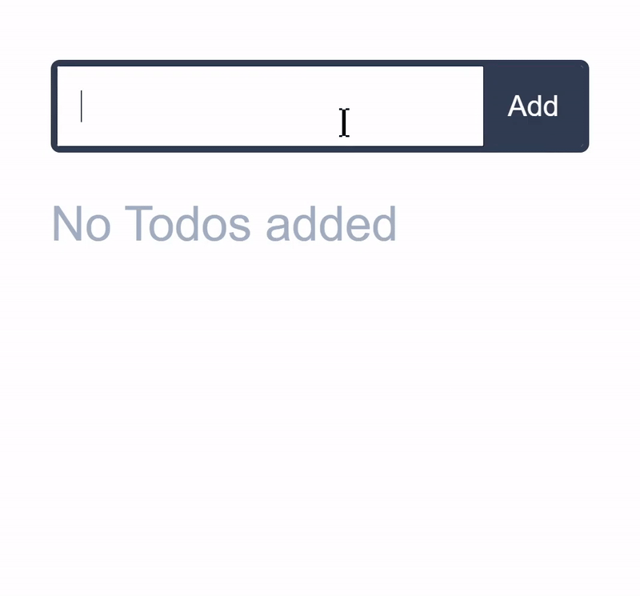

> This readme file is not ready yet, Project is still in v0.x and API may change. 🔨
>
> Your Feedback is very much appreciated 🙏

<br/>

<p align='center'>
  
</p>

<p align='center'> Dead Simple, Reactive, Blazing Fast Global State Management for React </p>


<!-- primary badges -------------------------------------->
<p align="center">
  <!-- version -->
  
  <!-- size -->
  
  <!-- downloads npm per week  -->
  
  <!-- chat -->
  <a href='https://join.slack.com/t/radioactive-store/shared_invite/zt-gwd1rsvr-vkoizw5RG5rk9rwsdgT3gQ'>
    
  </a>
  <!-- stars -->
  
  <!-- follow -->
  
  <!-- Twitter intent -->
  <a href='https://twitter.com/intent/tweet?url=https%3A%2F%2Fgithub.com%2FMananTank%2Fradioactive-store&via=MananTank_&text=Make%20your%20@reactjs%20App%20Truly%20Reactive%20with%20radioactive-store&hashtags=react%2CradioactiveState' target='_blank'>
    
  </a>
</p>

<!-- Coverage badges ---------------------------------- -->
<!-- <p align='center'>
  
  
  
  
</p>
<br/> -->


<br/>

## Features

⚛ Deeply Reactive, Mutate the State directly !

⚡ Fastest State Management Library !

😍 Dead Simple API

♻ No Extra Re-Renders

🍀 Always Fresh State


<br/>

## ⚛ Create Global State with `createGS`

Create a Global State in your main file (index.js) for your app by calling `createGS` with the state object, before rendering App.

That's it ! 🙌

**Example**

```js
// index.js
import { createGS } from 'radioactive-store'

createGS({
  count: 0
})

ReactDOM.render(<App />, root);
```
<br/>


## ☢ Using the Global State in Component with `useGS` hook

`useGS` hook returns the entire global state and takes a dependency array as argument.

dependency array is an array of strings that denotes which parts of global state the component uses to render it's UI. This is important because Component needs to be re-rendered ( UI needs to be updated ) when these parts change in state

#### Example

```js
// if the component's UI depends on state.a and state.b.c then use the hook like this:
const GS = useGS(['a', 'b.c'])
```

<br/>

## ⚡ Updating the Global State

`radioactive-store`'s state is deeply reactive. To update the state, you just mutate it!


> ### Global State is also available from `window.GS`, So You can mutate the global state from anywhere in the code and even from browser's console and components that needs to be re-rendered will re-render automatically. 😍

<br/>

## 🧁 Counter Example

[See Live Demo](https://codesandbox.io/s/counter-example-radioactive-store-1yly9?file=/src/Counter.js)

<p align='center'>
  
</p>

```jsx
// index.js
import { createGS } from 'radioactive-store'

createGS({
  count: 0
});
```


```jsx
// Counter.js
import { useGS } from "radioactive-store";

const Counter = () => {
  const GS = useGS([ "count" ]);
  const increment = () => GS.count++; // directly mutate GS 🙌

  return (
    <div className="count" onClick={increment}>
      {GS.count}
    </div>
  );
};
```


<br/>

## ✒ Todos Example

<p align='center'>
  
</p>

[Live Demo](https://codesandbox.io/s/todos-radioactive-store-x412g?file=/src/Todos.js)

```jsx
// index.js
import { createGS } from 'radioactive-store'

createGS({
  todos: []
});
```

```jsx
// Todos.js
import { useGS } from "radioactive-store";

const Todos = () => {

  const GS = useGS([ "todos" ]);

  const removeTodo = i => GS.todos.splice(i, 1);
  const addTodo = todo => GS.todos.push(todo);

  // ....
};
```
<br/>

