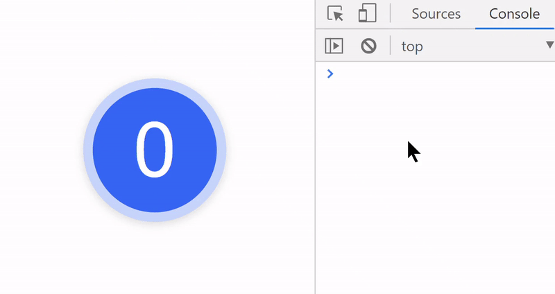

> This readme file is not ready yet, Project is still in v0.x and API may change. 🔨
>
> Your Feedback is very much appreciated 🙏

<br/>

<p align='center'>
  
</p>

<p align='center'> Dead Simple, Reactive, Blazing Fast Global State Management for React </p>


<!-- primary badges -------------------------------------->
<p align="center">
  <!-- version -->
  
  <!-- size -->
  
  <!-- downloads npm per week  -->
  
  <!-- chat -->
  <a href='https://join.slack.com/t/radioactive-store/shared_invite/zt-gwd1rsvr-vkoizw5RG5rk9rwsdgT3gQ'>
    
  </a>
  <!-- stars -->
  
  <!-- follow -->
  
  <!-- Twitter intent -->
  <a href='https://twitter.com/intent/tweet?url=https%3A%2F%2Fgithub.com%2FMananTank%2Fradioactive-store&via=MananTank_&text=Make%20your%20@reactjs%20App%20Truly%20Reactive%20with%20radioactive-store&hashtags=react%2CradioactiveState' target='_blank'>
    
  </a>
</p>

<!-- Coverage badges ---------------------------------- -->
<!-- <p align='center'>
  
  
  
  
</p>
<br/> -->


<br/>

## Features

☢ Deeply Reactive, Mutate the State directly !

⚡ Blazing Fast: Fastest State Management Library !

😍 Dead Simple API

♻ Super Efficient : No Extra Re-Renders

🍀 Always Fresh State

⚛ Reactive Props

✒ Reactive Input Bindings


<br />

> ### This library is a superset of [radioactive-state](https://github.com/MananTank/radioactive-state) for global. All its features are available in `radioactive-store` as well.


<br/>


## 🛠 Installation

```bash
npm i radioactive-store
```

<br/>

## ☢ Create Global State with `createState`

You can call `createState` with an object and that object will becomes a reactive global state and will be available in `window.state`

**Example**

```js
// index.js
import { createState } from 'radioactive-store'

createState({
  count: 0
})

ReactDOM.render(<App />, root);
```
<br/>


## 📂 Using the Global State in Component

You can you global state anywhere using `window.state`

But, When using some part of global state in a Component to render UI, we have to re-render component when that part of state changes. To do that we use `useDeps` to denote the dependency of component

`useDeps` takes a dependency array as argument. This dependency array is an array of strings that denotes which parts of global state the component depends on to render it's UI. This is used to re-render Component when any of these parts changes

#### Example

```js
// if the Foo component's UI depends on
// window.state.a and window.state.b.c then use the hook like this:
import { useDeps } from 'radioactive-store'

const Foo = () => {
  useDeps(['a', 'b.c'])

  // ...
}
```

<br/>

## ⚡ Updating Global State

`radioactive-store`'s state ( window.state ) is deeply reactive. To update the state, you just mutate it!


> ### Since the global state is available in `window.state` You can mutate the global state from anywhere in the code and even from browser's console and components that needs to be re-rendered will re-render automatically. 😍

<br/>

## 🧁 Counter Example

[Open Live Demo](https://codesandbox.io/s/counter-example-radioactive-store-1yly9?file=/src/Counter.js)

<!-- <p align='center'>
  
</p> -->

```jsx
// index.js
import { createState } from 'radioactive-store'

createState({
  count: 0
});
```


```jsx
// Counter.js
/* globals state */
import { useDeps } from "radioactive-store";

const increment = () => state.count++
const reset = () => state.count = 0

const Counter = () => {
  useDeps([ "count" ]);
  return (
    <>
      <div onClick={increment}> {state.count} </div>
      <div onClick={reset}> Reset </div>
    </>
  );
};
```
> since state is available in window,  we can directly use state instead of `window.state`
>
> But if you have ESlint setup, it will complain that state is not defined. to fix this either add a comment `/* globals state */` as shown above or add the state as a global variable in eslint.config

 `increment` and `reset` functions outside of component. It's always a good idea of define the functions outside of component whenever possible for better performance, because functions defined inside of components are created every time the component is rendered.


<br/>


> To be Continued ...


<!-- ## 🌟 Creating Actions

Creating actions is completely optional and radioactive-store does not provide any APIs to do so, however since global state is available in the global object, I th -->

<!-- ### What is an action ?

In other state management libraries an `action` is an object that represents a user action by a string and payload. But In this library I will refer to the functions that actually performs the action as `action`. I think this makes more sense since an action - as the name suggests is something that happens - it's a function.

So, According to this definition, we have already defined various actions such as `increment` and `reset` in the counter example
`
As we saw in Counter Example, we defined the actions `increment` and `reset` outside of the component. Let's take this a step further and store it in a global object so they can be called from anywhere.

`radioactive-store` does not have any opinions about how and where you store your actions. But here's my recommendation:

I recommend putting related actions in one object and saving them in `window.actions` object. But this is just a suggestion and you don't *have* to do it.

#### Example

```js
// index.js

createState({
  count: 0
})

const {state} = window

window.actions = {
  count: {
    increment: () => state.count++,
    reset: () => state.count = 0,
  }
}
```

Now we can refactor the Counter Component like to use global actions like this

```jsx
// Counter.js
import { useDeps } from "radioactive-store";
const { state } = window
const { increment, reset } = window.actions.count

const Counter = () => {
  useDeps([ "count" ])
  return (
    <>
      <div onClick={increment}> {state.count} </div>
      <div onClick={reset}> Reset </div>
    </>
  );
};
``` -->